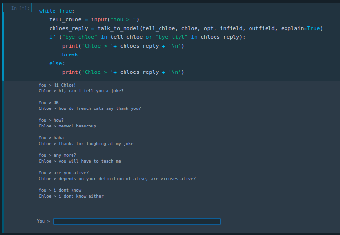
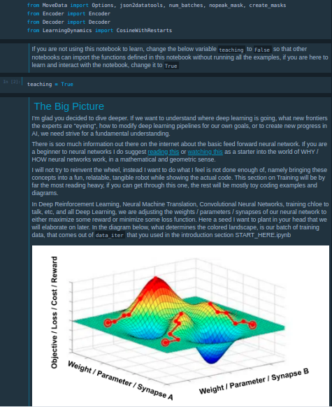

# chat-transformer
over-documented over-explained chatbot using original transformer as sequence-to-sequence model 

## What is this?

My research interest is in incorporating the the latest research in natural language processing and reinforcement learning into palpable human interaction such as fully neural network based conversational dialogue.  

*chloe* is an end to end neural network chatbot written in PyTorch based on the transformer. Accomplishing goals through conversation is a task we can all relate to, thus chatbots are an ideal agent through which to connect new research to our current understanding of AI and demonstrate new research. *chloe* is built from modules that are thoroughly explained and demonstrated using jupyter notebooks and toy examples that build from these basics.  

- Python 3.6
- torch==1.7.1 (PyTorch)
- torchtext 
- nltk==3.4.5 (Natural Language Toolkit)

## Table of Contents

- [START_HERE](START_HERE.ipynb) introduction, summon and meet *chloe*
- [Trainer](notebooks/Trainer.ipynb) Tokenization in Sequnce to Sequence learning, intuitive explaination of Loss Functions using a toy example of cross entropy  
- [Building Blocks of Neural Networks](notebooks/Elements.ipynb) Word Vector Embeddings, Positional Encoding, Neural Networks, Attention, Masking 
- [The Network Architecture](notebooks/EncoderDecoder.ipynb) Assembling the building blocks into an encoder and decoder
- [Talk](notebooks/Talk.ipynb) How chloe chooses which words to say in a sentence and some basic probability

## How to Start

if you already have python 3.6 and virtual environments, create a python 3.6 virtual environment, here i used env36 for python3.6 but you can use anything

`$ python3.6 -m venv env36`

if python3.6 is your default version, then when you type `python` into your terminal then it should say python version 3.6.x, and for you making the virtual environment is as simple as 

`$ python -m venv env`

otherwise it is simple to get python3.6 and virtual environments

[how to install Python 3.6 on ubuntu](http://ubuntuhandbook.org/index.php/2017/07/install-python-3-6-1-in-ubuntu-16-04-lts/)

install [virtual environment](https://towardsdatascience.com/virtual-environments-104c62d48c54) then 

[how to specify the Python executable you want to use](https://stackoverflow.com/questions/1534210/use-different-python-version-with-virtualenv)

`sudo add-apt-repository ppa:jonathonf/python-3.6`

`sudo apt-get update`

`sudo apt-get install python3.6`

`virtualenv --python=/usr/bin/python3.6 env36`

When you want to run the code activate the virtual environment inside the same folder as your environment env using 

`$ source env/bin/activate`

install dependencies

`$ pip install -r requirements.txt`

[even with virtual environments, some troubleshoot might be needed](https://github.com/tensorflow/tensorflow/issues/559)

[with enough google searches you can find an answer for almost any problem](https://stackoverflow.com/questions/45912674/attributeerror-module-numpy-core-multiarray-has-no-attribute-einsum)

save new dependences to requirements

`$ pip freeze > requirements.txt`

You can deactivate the virtual environment using the following command in your terminal:

`$ deactivate`

## More Tips and Tricks

if you get a `ImportError: No module named` while at the same time in your Terminal you get 

`pip3 install import-ipynb`

`Requirement already satisfied: import-ipynb in /path/to/env/lib/python3.6/site-packages (0.1.3)`

This can be fixed by providing your python interpreter with the path-to-your-module,the path 

`import sys`

`sys.path.append('/path/to/env/lib/python3.6/site-packages')` 

## Suggested resources for those new to python or deep learning 

- [Python tutorials](https://www.learnpython.org/) 
- [jupyter notebooks](https://youtu.be/pxPzuyCOoMI) 
- [3Blue1Brown's Essence of linear algebra](https://youtu.be/fNk_zzaMoSs) 
- [3Blue1Brown's Neural Networks](https://youtu.be/aircAruvnKk)
- [PyTorch tutorial](https://pytorch.org/tutorials/beginner/blitz/tensor_tutorial.html#sphx-glr-beginner-blitz-tensor-tutorial-py) 
